# 🚀 AI Career Coach

[](https://ai-coach-final.web.app)
[](https://opensource.org/licenses/MIT)
[](https://python.org)
[](https://reactjs.org)

> **🌟 Live Demo**: [https://ai-coach-final.web.app](https://ai-coach-final.web.app)

A cutting-edge, full-stack AI-powered career coaching platform that provides personalized career recommendations using Google's Gemini AI. Built with modern cloud-native architecture and deployed on Google Cloud Platform for global scalability.


---

## 📋 Table of Contents

- [✨ Features](#-features)
- [🏗️ Architecture](#️-architecture)
- [🛠️ Tech Stack](#️-tech-stack)
- [🚀 Quick Start](#-quick-start)
- [💻 Local Development](#-local-development)
- [☁️ Deployment](#️-deployment)
- [📊 Analytics Dashboard](#-analytics-dashboard)
- [🔒 Security](#-security)
- [🤝 Contributing](#-contributing)
- [📄 License](#-license)

---

## ✨ Features

### 🤖 **AI-Powered Intelligence**
- **Advanced AI Analysis**: Powered by Google Gemini 1.5 Flash for deep profile analysis
- **Smart Matching Algorithm**: Calculates personalized Match Scores for career recommendations
- **Multi-dimensional Assessment**: Analyzes skills, interests, goals, and market trends

### 👤 **Personalized Experience**
- **Tailored Career Paths**: Multiple customized career recommendations
- **Session Persistence**: Seamless user experience with Firestore integration
- **Progress Tracking**: Monitor your career exploration journey

### 📊 **Real-time Analytics**
- **Live Dashboard**: Looker Studio integration for trend visualization
- **Data-driven Insights**: Track most recommended careers and user patterns
- **Performance Metrics**: Real-time usage statistics and engagement data

### 🎨 **Modern User Interface**
- **Responsive Design**: Optimized for all devices and screen sizes
- **Smooth Animations**: Professional transitions and micro-interactions
- **Accessibility First**: WCAG compliant design principles

### ☁️ **Cloud-Native Architecture**
- **Serverless Deployment**: Auto-scaling with Google Cloud Run
- **Global CDN**: Lightning-fast content delivery via Firebase Hosting
- **Zero Downtime**: Automatic scaling based on demand

---

## 🏗️ Architecture

```mermaid
graph TD
    A[🌐 User Browser] --> B[🔥 Firebase Hosting<br/>React Frontend]
    B --> C[☁️ Cloud Run<br/>Python/Flask API]
    C --> D[🤖 Google Gemini AI]
    C --> E[📊 Firestore Database]
    E --> F[📈 Looker Studio<br/>Analytics Dashboard]
    
    subgraph "🏗️ Google Cloud Platform"
        direction TB
        C
        D
        E
        F
        G[🔐 Secret Manager]
    end
    
    C --> G
    
    style A fill:#e1f5fe
    style B fill:#fff3e0
    style C fill:#e8f5e8
    style D fill:#f3e5f5
    style E fill:#fff8e1
    style F fill:#e3f2fd
    style G fill:#fce4ec
```



### **Architecture Highlights**
- **Frontend**: React SPA hosted on Firebase with global CDN
- **Backend**: Containerized Flask API on Cloud Run (serverless)
- **Database**: NoSQL Firestore for real-time data synchronization
- **AI Engine**: Google Gemini 1.5 Flash for natural language processing
- **Security**: Google Secret Manager for credential management
- **Analytics**: Looker Studio for business intelligence

---

## 🛠️ Tech Stack

### **Frontend**
- **Framework**: React 18 with Vite
- **Styling**: Tailwind CSS
- **Build Tool**: Vite for fast development
- **Hosting**: Firebase Hosting

### **Backend**
- **Language**: Python 3.9+
- **Framework**: Flask
- **Container**: Docker
- **Hosting**: Google Cloud Run

### **AI & Database**
- **AI Model**: Google Gemini 1.5 Flash
- **Database**: Google Firestore (NoSQL)
- **Analytics**: Google Looker Studio

### **DevOps & Security**
- **Cloud Platform**: Google Cloud Platform (GCP)
- **Secret Management**: Google Secret Manager
- **CI/CD**: GitHub Actions (optional)
- **Monitoring**: Google Cloud Monitoring

---

## 🚀 Quick Start

### Prerequisites

Before you begin, ensure you have the following installed:

- **Node.js** (v18.0 or higher) - [Download here](https://nodejs.org/)
- **Python** (v3.9 or higher) - [Download here](https://python.org/)
- **Git** - [Download here](https://git-scm.com/)
- **Google AI API Key** - [Get it free from Google AI Studio](https://aistudio.google.com/)

### One-Command Setup

```bash
# Clone and setup the entire project
git clone https://github.com/Abhishek2634/Gen-AI.git
cd Gen-AI && npm run setup
```

---

## 💻 Local Development

### Step 1: Repository Setup

```bash
git clone https://github.com/Abhishek2634/Gen-AI.git
cd Gen-AI
```

### Step 2: Backend Configuration

```bash
# Navigate to server directory
cd server

# Create and activate virtual environment
python -m venv venv

# Activate virtual environment
# Windows:
venv\Scripts\activate
# macOS/Linux:
source venv/bin/activate

# Install dependencies
pip install -r requirements.txt
```

### Step 3: Environment Variables

Create a `.env` file in the `server` directory:

```env
# Required: Google AI API Key
GOOGLE_API_KEY=your_google_ai_api_key_here

# Optional: Development settings
FLASK_ENV=development
FLASK_DEBUG=true
PORT=5000
```

### Step 4: Frontend Setup

Open a new terminal:

```bash
# Navigate to client directory
cd client

# Install dependencies
npm install
```

### Step 5: Start Development Servers

**Terminal 1 (Backend):**
```bash
cd server
source venv/bin/activate  # or venv\Scripts\activate on Windows
flask run
```
*Backend will run on: http://127.0.0.1:5000*

**Terminal 2 (Frontend):**
```bash
cd client
npm run dev
```
*Frontend will run on: http://localhost:5173*

### 🎉 Access Your Application

Open your browser and navigate to: **http://localhost:5173**

---

## ☁️ Deployment

### Production Deployment Architecture

The application is deployed using a modern serverless architecture:

#### **Backend Deployment (Cloud Run)**
- Containerized Flask application
- Auto-scaling based on traffic
- Pay-per-use pricing model
- Zero cold-start optimized

#### **Frontend Deployment (Firebase Hosting)**
- Static React build served via global CDN
- Automatic SSL certificates
- Edge caching for optimal performance
- Custom domain support

#### **Database (Firestore)**
- Real-time NoSQL database
- Automatic scaling and backup
- Multi-region replication
- ACID transaction support

### Deployment Commands

```bash
# Deploy backend to Cloud Run
gcloud run deploy ai-coach-backend --source .

# Deploy frontend to Firebase
firebase deploy --only hosting
```

---

## 📊 Analytics Dashboard

### Real-time Insights

Our integrated Looker Studio dashboard provides:

- **User Engagement Metrics**: Session duration, page views, conversion rates
- **Career Trends**: Most recommended careers, skill gap analysis
- **Performance Monitoring**: API response times, error rates
- **Geographic Distribution**: User locations and regional preferences

**Dashboard Access**: [View Analytics](https://lookerstudio.google.com/your-dashboard-link)

---

## 🔒 Security

### Security Features Implemented

- **🔐 API Key Management**: Google Secret Manager integration
- **🛡️ CORS Protection**: Configured for secure cross-origin requests
- **🔒 HTTPS Enforcement**: SSL/TLS encryption for all communications
- **🚫 Input Sanitization**: Protection against injection attacks
- **📝 Audit Logging**: Comprehensive request/response logging
- **🔑 Authentication Ready**: Extensible for OAuth/Firebase Auth

### Security Best Practices

```bash
# Environment variables (never commit to repo)
echo ".env" >> .gitignore

# Secure API key storage
gcloud secrets create google-ai-key --data-file=key.txt
```

---

## 🤝 Contributing

We welcome contributions! Here's how you can help:

### Development Workflow

1. **Fork the repository**
2. **Create a feature branch**: `git checkout -b feature/amazing-feature`
3. **Make your changes and test thoroughly**
4. **Commit with conventional commits**: `git commit -m "feat: add amazing feature"`
5. **Push to your branch**: `git push origin feature/amazing-feature`
6. **Open a Pull Request**

### Code Standards

- **Python**: Follow PEP 8 style guidelines
- **JavaScript**: Use ESLint and Prettier configurations
- **Commits**: Follow conventional commit format
- **Documentation**: Update README for any new features

### Testing

```bash
# Run backend tests
cd server && python -m pytest

# Run frontend tests
cd client && npm test
```

---

## 📈 Roadmap

### Upcoming Features

- [ ] **Multi-language Support**: Internationalization (i18n)
- [ ] **Advanced Analytics**: Predictive career modeling
- [ ] **Social Features**: Career path sharing and community
- [ ] **Mobile App**: React Native implementation
- [ ] **Integration APIs**: LinkedIn, Indeed job board connections
- [ ] **AI Improvements**: Fine-tuned domain-specific models

### Version History

- **v1.0.0** - Initial release with core AI coaching features
- **v1.1.0** - Added analytics dashboard and user persistence
- **v1.2.0** - Enhanced UI/UX with animations and responsive design

---

## 📞 Support & Contact

### Getting Help

- **📚 Documentation**: Check our [Wiki](https://github.com/Abhishek2634/Gen-AI/wiki)
- **🐛 Bug Reports**: [Create an issue](https://github.com/Abhishek2634/Gen-AI/issues/new?template=bug_report.md)
- **💡 Feature Requests**: [Request a feature](https://github.com/Abhishek2634/Gen-AI/issues/new?template=feature_request.md)
- **💬 Discussions**: [Join our community](https://github.com/Abhishek2634/Gen-AI/discussions)

### Project Maintainers

- **Lead Developer**: [@Abhishek2634](https://github.com/Abhishek2634)

---

## 📄 License

This project is licensed under the **MIT License** - see the [LICENSE](LICENSE) file for details.

---

## 🌟 Acknowledgments

- **Google Cloud Platform** for robust cloud infrastructure
- **Google AI** for Gemini API access and capabilities  
- **React Community** for excellent documentation and resources
- **Open Source Contributors** who make projects like this possible

---

<div align="center">

### ⭐ If this project helped you, please consider giving it a star!

[](https://github.com/Abhishek2634/Gen-AI)
[](https://github.com/Abhishek2634/Gen-AI)

**Made with ❤️ by the AI Career Coach Team**

</div>
